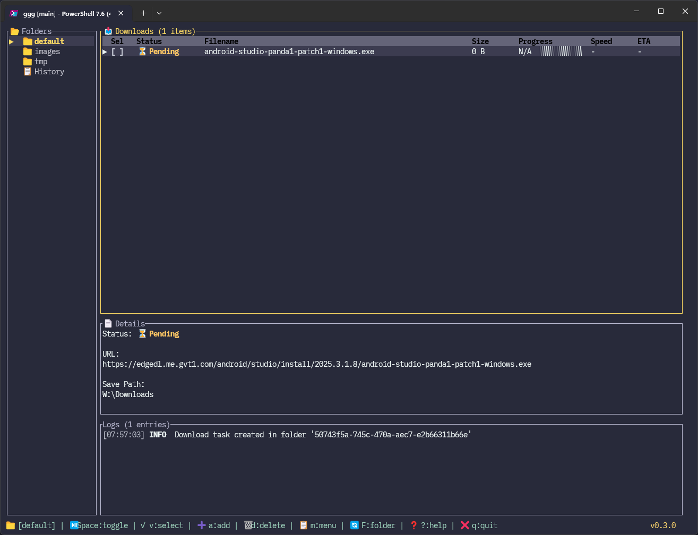

# ggg

A terminal-based download manager, built in Rust.



## Features

- **Core Download Engine** — HTTP/HTTPS streaming, resume (Range/ETag), concurrent downloads, automatic retry with exponential backoff, queue persistence
- **Vim-Style TUI** — Keyboard-first interface inspired by vim/lazygit. Split view, tab-based filtering, inline editing, drag & drop URL detection
- **Three-Tier Settings** — Application → Folder → Queue priority chain. Per-folder save path, concurrency, headers, auto-date directories
- **Script Hooks (JavaScript)** — 6 lifecycle hooks (`beforeRequest`, `headersReceived`, `authRequired`, `completed`, `error`, `progress`) powered by V8 via deno_core. URL regex filtering, auto-loading from `scripts/` directory. See [Script User Guide](docs/Script_UserGuide.md)
- **Interactive Dialogs** — Add download, folder management, search/filter, help screen, confirmation prompts
- **i18n** — English / Japanese (~180 strings via Mozilla Fluent, runtime switchable)

## Installation

### From GitHub Releases

TBD

### From Source (Recommended)

```bash
# Clone repository
git clone https://github.com/yuiAs/ggg.git
cd ggg

# Build release version
cargo build --release

# Binary will be at: target/release/ggg.exe (Windows) or target/release/ggg (Linux/macOS)
```

### Requirements
- **Rust** 1.85+ (edition 2024)
- **Windows Terminal** recommended (for best TUI experience)
- Any ANSI-compatible terminal works (cmd, PowerShell, WSL, SSH)

## Usage

### Launch TUI

```bash
# Run from source
cargo run

# Or run compiled binary
./target/release/ggg
```

### Keybindings

For a complete keybindings reference, see the [KeyBindings Guide](docs/KeyBindings.md) or press `?` in the TUI for the help screen.

## Configuration

ggg uses a TOML-based configuration system with application-wide and folder-specific settings.

For a complete configuration example, see `config/settings.toml.example` in the release archive or repository.

For detailed configuration options and examples, see the [Configuration Guide](docs/Config.md).

## Project Structure

For detailed project structure and module organization, see the [Project Structure Guide](docs/dev/Project_Structure.md).

## Development

### Running Tests

```bash
# Run all tests
cargo test

# Run specific test suite
cargo test --test download_manager_tests

# Run with output
cargo test -- --nocapture
```

### Building

```bash
# Development build
cargo build

# Release build (optimized)
cargo build --release

# Check without building
cargo check
```

## ggg-dnd (Windows only)

`ggg-dnd` is a lightweight Win32 GUI helper that accepts browser drag & drop and forwards URLs to the TUI via Named Pipes. This works around Windows Terminal's limited drag & drop support.

- Entire window is an OLE drop target — drag a URL from your browser onto it
- Communicates with `ggg` over Named Pipe (`\\.\pipe\ggg-dnd`)
- Can be auto-launched from `ggg` via the `Auto Launch ggg-dnd` setting

### Building

```bash
# Build ggg-dnd only
cargo build -p ggg-dnd --release

# Build both ggg and ggg-dnd
cargo build --release
```

The binary will be at `target/release/ggg-dnd.exe`. Place it in the same directory as `ggg.exe` for auto-launch to work.

## Known Issues

### Platform-Specific
- **Windows Terminal - Drag & Drop:**
  - **Current Workaround:** D&D is supported via rapid character input detection. When you drag a URL from your browser to the terminal in Normal mode, it will be automatically detected and added to the download queue.
  - **Known Issue:** crossterm does not fire `Event::Paste` events on Windows Terminal/PowerShell (see [crossterm#737](https://github.com/crossterm-rs/crossterm/issues/737) and [helix#9243](https://github.com/helix-editor/helix/discussions/9243)).
  - **Future:** When crossterm is fixed, drag & drop will work more reliably via proper paste events.
  - **Alternative:** Use `a` key to open Add Download dialog, then paste URL with `Ctrl+V`.
- **cmd.exe/PowerShell:** Limited terminal features, Windows Terminal recommended
- **WSL:** Works well, but may need terminal emulator with good Unicode support

### Limitations
- No GUI version (by design - TUI is the primary interface)
- Single-threaded downloads per file (chunk-based multi-connection acceleration not yet implemented)

## License

[MIT License](LICENSE)

## Acknowledgments

Inspired by classic download managers:
- **Iria** / **Irvine** (Windows download manager)
- **ReGet** (Windows download manager)

Built with:
- [ratatui](https://github.com/ratatui-org/ratatui) - Terminal UI framework
- [crossterm](https://github.com/crossterm-rs/crossterm) - Terminal manipulation
- [deno_core](https://github.com/denoland/deno_core) - V8 JavaScript runtime
- [tokio](https://tokio.rs/) - Async runtime
- [reqwest](https://github.com/seanmonstar/reqwest) - HTTP client
- [serde](https://serde.rs/) - Serialization
